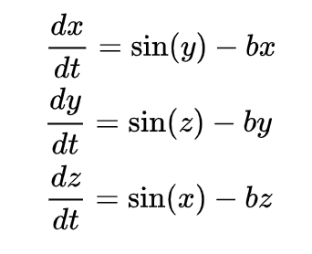

# Thomas' cyclically symmetric attractor

This strange attractor is a 3D symetric strange attractor. It can be viewed as the trajectory of a frictionally dampened particle moving in a 3D lattice of forces. The equations are as follows:

This project is being started to both learn and become familiar with Java. The rendering of the graphics will be done in P3 processing. 

Code in this repo should be pasted into the P3 GUI for running. Instructions on this are to come as code is written. 

