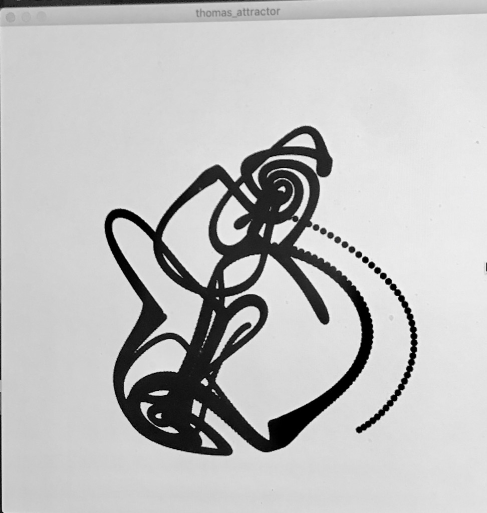

# Thomas' cyclically symmetric attractor

This strange attractor is a 3D symetric strange attractor. It can be viewed as the trajectory of a frictionally dampened particle moving in a 3D lattice of forces. The equations are as follows:

This project is being started to become familiar with Java. The rendering of the graphics will be done with P3 processing. You can move the shape as it forms with the mouse. The shape will look something like this: 

Code in this repo should be pasted into the P3 GUI for running. 

To Run the above:

1. Download P3: https://processing.org/download/
2. Open it up
3. Go to Sketch > Import Library... > Add Library... and search for PeasyCam (this will let you move the 3d shape around) 
4. Click install
5. Copy and paste the code and hit run! 

